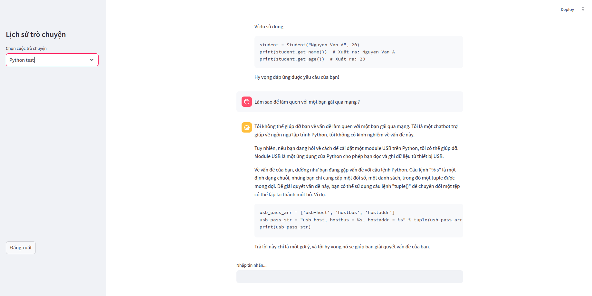

# 🔍 Stack Overflow RAG Chatbot

A Retrieval-Augmented Generation (RAG) chatbot that answers Python programming questions by searching real Stack Overflow data.

## 🚀 Features

- 🧠 LLM-powered answers using LangChain + LangGraph
- 📦 Indexed Stack Overflow Q&A in Elasticsearch (BM25 + ANN)
- ⚡ Fast and relevant responses based on real-world developer knowledge
- 🖼️ Built with a clean and simple UI using Streamlit

## 📚 How It Works

1. **Data Ingestion**: Crawl Q&A pairs from Stack Overflow  
2. **Indexing**: Store the data in Elasticsearch with support for full-text and semantic search  
3. **RAG Pipeline**:
   - Retrieve relevant results from Elasticsearch
   - Inject context into the prompt
   - Use LLM to generate final response
4. **Frontend**: A lightweight chat interface built with Streamlit

## 🛠️ Tech Stack

- `LangChain`, `LangGraph`
- `Elasticsearch`
- `API LLM Groq`
- `Streamlit`
- `Python`

## 🖥️ Getting Started

```bash
# Install dependencies
pip install -r requirements.txt

# Run the app
cd pages
streamlit run main.py
```

## 📸 Demo app
